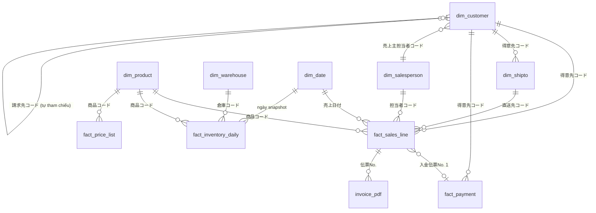

# Liên kết dữ liệu — các file OBC nối với nhau thế nào

Tài liệu này trả lời: *dữ liệu từ các file xuất của OBC ghép lại với nhau bằng khoá nào.*
Đây là nền tảng của toàn bộ schema. Đọc trước khi sửa bất kỳ thứ gì trong `db/migrations/`.

## 1. Sơ đồ quan hệ



## 2. Bảng khoá — khoá nào xuất hiện ở file nào

| Khoá | Định dạng | Ví dụ thật | Có mặt trong |
|---|---|---|---|
| `得意先コード` | **text 12 ký tự** | `000000009292`, `202312190003` | 得意先全情報 · 売上伝票データ · 直送先 · 入金伝票データ · 得意先元帳 · tên file PDF |
| `商品コード` | **text, chữ + số** | `XT07`, `AO02`, `000000000001` | 商品データ · 売上伝票データ · 取引単価データ · 在庫一覧 |
| `伝票No.` | text 6 chữ số | `079934` | 売上伝票データ · 売上明細表 · tên file PDF |
| `担当者コード` | text 4 chữ số | `0104`, `0105` | 得意先全情報 (`売上主担当者コード`) · 売上伝票データ · 入金伝票データ |
| `直送先コード` | text 10 chữ số | `0000000001` | 直送先 · 売上伝票データ |
| `倉庫コード` | text 4 chữ số | `0001`, `1002` | 在庫一覧 |
| `荷姿区分コード` | text 2 chữ số | `00`, `02` | 商品データ · 取引単価データ · 売上伝票データ · 在庫一覧 |
| `請求先コード` | text 12 ký tự | `000000009292` | 売上伝票データ · 請求先元帳 |
| `仕入先コード` | text 4 chữ số | `0001` | 仕入先 |
| `入金伝票No.` | text | — | 入金伝票データ · 売上伝票データ (`入金伝票No.１`) |

> ### ⚠️ LUẬT SỐNG CÒN: mọi mã đều là TEXT, không bao giờ là số
>
> `000000009292` đọc thành số sẽ thành `9292` — **mất số 0 đầu, không ghép được với bất kỳ bảng nào**.
> Đây là lỗi kinh điển khi đọc Excel bằng pandas. Mọi cột `*コード` phải ép `dtype=str` ngay từ lúc đọc file.
> Cổng kiểm tra 2 phải phát hiện nếu một cột mã bị đọc thành số.

## 3. Những chỗ dễ hiểu sai

### 3.1 `得意先コード` có hai dạng cùng tồn tại

| Dạng | Ví dụ | Ý nghĩa |
|---|---|---|
| Số thứ tự | `000000009292` | Khách cũ, đánh số tuần tự |
| Theo ngày tạo | `202312190003` | `YYYYMMDD` + số thứ tự trong ngày |

Cả hai đều dài 12 ký tự. **Không được suy đoán ý nghĩa từ định dạng** — chỉ dùng làm khoá.

### 3.2 `得意先` ≠ `請求先` (bên mua ≠ bên trả tiền)

Một khách hàng có thể được xuất hoá đơn cho một pháp nhân khác (công ty mẹ, đơn vị thanh toán tập trung). Đó là lý do OBC có **hai sổ cái riêng**: `得意先元帳` và `請求先元帳`.

Trong mẫu đã khảo sát, hai mã thường trùng nhau — **nhưng schema bắt buộc phải cho phép chúng khác nhau**. `dim_customer` tự tham chiếu qua `請求先コード`.

Hệ quả cho báo cáo: **phân tích doanh số theo `得意先`, phân tích công nợ theo `請求先`.** Nhầm hai cái này thì số liệu công nợ sẽ sai.

### 3.3 `直送先` có thể không thuộc khách nào

`直送先` (điểm giao thẳng) nối về `得意先` qua `得意先コード`, nhưng **cột này có thể để trống** — đã thấy trong dữ liệu thật (`PLE葉WALK浜北` không có mã khách). Quan hệ là *không bắt buộc*, không được đặt khoá ngoại NOT NULL.

### 3.4 Chuỗi liên kết giá — dùng để phát hiện bán dưới giá

Đây là liên kết có giá trị kinh doanh cao nhất, và nó đi qua ba file:

```
得意先全情報.売価No.コード        (ví dụ "10" → khách này dùng bảng giá số 10)
            │
            ▼
取引単価データ [商品コード + 荷姿区分コード]
            └─► 売価No.10（税抜）   = giá đáng lẽ phải bán
            │
            ▼  so sánh với
売上伝票データ.単価                = giá thực tế đã bán
```

Chênh lệch giữa hai con số này chính là **tiền rơi vãi**. Báo cáo ③ dựa hoàn toàn vào chuỗi liên kết này.

Lưu ý: `取引単価データ` có khoá **`商品コード` + `荷姿区分`** (cùng một mã hàng bán lẻ `バラ` và bán thùng `ケース` có giá khác nhau), nên khi ghép phải dùng cả hai, không chỉ mã hàng.

### 3.5 Hoá đơn PDF ghép được mà không cần đọc nội dung

Tên file có dạng:

```
請求書_035601_202405160002_THTT 合同会社御中_20250602103902.pdf
       ▲      ▲            ▲                 ▲
       伝票No. 得意先コード   tên khách         thời điểm in
```

→ Tách bằng biểu thức chính quy là có ngay bảng chỉ mục `伝票No. ↔ 得意先コード ↔ đường dẫn PDF`. **Không cần thư viện đọc PDF nào.** (Ngoài phạm vi Giai đoạn 0, ghi lại để sau này khỏi phải tìm lại.)

### 3.6 `担当者` của OBC ≠ người nhập đơn trên web

Xem §12.1 của đặc tả. `dim_salesperson` **chỉ chứa 5 `担当者` của OBC**. Người nhập đơn (gồm 2 arubaito) thuộc bảng khác, schema `app`. Ghép bằng **mã** qua `config/salesperson_map.yml`, **không bao giờ ghép bằng tên** — hai hệ thống viết tên khác nhau (`TRAN THI LAN THANH` vs `Trần Thị Lan Thanh`).

## 4. Độ hạt của từng bảng sự kiện

| Bảng | Khoá duy nhất | Đã kiểm chứng |
|---|---|---|
| `fact_sales_line` | `伝票No.` + số thứ tự dòng | Cần xác nhận khi có file mẫu hằng ngày |
| `fact_inventory_daily` | `商品コード` + `倉庫コード` + ngày snapshot | ✅ 177 khoá / 177 dòng, 0 trùng |
| `fact_payment` | `入金伝票No.` + số thứ tự dòng | Cần xác nhận |
| `fact_price_list` | `商品コード` + `荷姿区分コード` + `売価No.` + ngày hiệu lực | — |

## 5. Kiểu dữ liệu — ba luật

| Loại | Kiểu | Lý do |
|---|---|---|
| Mọi cột `*コード` | `TEXT` | Giữ số 0 đầu — xem cảnh báo §2 |
| **Tiền** (`金額`, `原価`, `粗利益`, `在庫金額`, `単価`) | `BIGINT` (yên nguyên) | Luật bất biến #3 — không dùng số thực cho tiền |
| **Số lượng** (`数量`, `在庫残数`) | `NUMERIC(14,4)` | **Có phần thập phân thật** — `83.75` ケース đã thấy trong dữ liệu |
| Tỷ suất (`粗利益率`, `消費税率`) | `NUMERIC(6,4)` | `0.3397`, `0.08` |

Số lượng thập phân là ngoại lệ dễ quên nhất: luật "không dùng số thực" chỉ áp cho **tiền**, không áp cho **số lượng**.
